<p align="center">
  
</p>

<p align="center">
  
</p>

<p align="center">
  <a href="https://www.linkedin.com/in/zujaja-arif"></a>
  <a href="mailto:zujajaarif786@gmail.com"></a>
  <a href="https://github.com/zujajaarif786-coder/portfolio"></a>
</p>


## 👩‍💻 About Me

I'm a BS Software Engineering student at the **University of Gujrat** (Graduating 2027). I like turning real workflows, such as donations, hostels, and libraries, into working software on top of well-designed databases. Alongside that, I'm building depth in **Generative AI and AI agent development**.

<p align="center">
  
</p>


## 🛠️ Tech Stack

**Languages**<br/>


**Web & Design**<br/>


**Databases**<br/>


**Tools**<br/>


**AI**<br/>


**Core engineering:** OOP · Data Structures & Algorithms · SDLC · Software Metrics · Debugging


## 🚀 Featured Projects

<table>
  <tr>
    <td width="50%" valign="top">
      <h3>🏛️ Donation Management System</h3>
      <p>Cross-platform system for donor tracking and contribution reporting, built following SDLC principles.</p>
      <p></p>
      <ul>
        <li>Modular Python scripts for data analysis</li>
        <li>Performance-optimized C++ core</li>
      </ul>
      <!-- Once the repo is public, add: <a href="https://github.com/zujajaarif786-coder/REPO-NAME">View repository</a> -->
    </td>
    <td width="50%" valign="top">
      <h3>🏠 Hostel Management System</h3>
      <p>Centralized system for room allocation, student records, and fee tracking.</p>
      <p></p>
      <ul>
        <li>Relational schemas designed for data integrity</li>
        <li>Efficient record retrieval</li>
      </ul>
      <!-- Add repository link here -->
    </td>
  </tr>
  <tr>
    <td width="50%" valign="top">
      <h3>📚 Library Management System</h3>
      <p>Desktop application that automates book circulation and user history.</p>
      <p></p>
      <ul>
        <li>Full CRUD operations</li>
        <li>OOP design for reuse and maintainability</li>
      </ul>
      <a href="https://github.com/zujajaarif786-coder/library_management">View repository →</a>
    </td>
    <td width="50%" valign="top">
      <h3>🛒 Online Shopping Web App</h3>
      <p>Responsive e-commerce interface with dynamic product catalogs and shopping cart logic.</p>
      <p></p>
      <ul>
        <li>Responsive design</li>
        <li>Cart and catalog logic</li>
      </ul>
      <!-- Add repository link here -->
    </td>
  </tr>
</table>

**More repositories:**
[University Management System](https://github.com/zujajaarif786-coder/university-management-system-) ·
[Inventory System](https://github.com/zujajaarif786-coder/inventory-system) ·
[Restaurant App](https://github.com/zujajaarif786-coder/Restaurant_app) ·
[Cinema](https://github.com/zujajaarif786-coder/cinema) ·
[Portfolio](https://github.com/zujajaarif786-coder/portfolio)


## 🗺️ Journey

```text
2020 ── Started freelance home tutoring (ongoing)
  │
2023 ── Began BS Software Engineering, University of Gujrat
  │     └ Lead Coordinator, Blood Society UoG (managed 20+ volunteers)
  │
2024 ── Technical Participant, Business Incubation Center, UoG
  │
2025 ── Vanderbilt: Generative AI & Prompt Engineering; AI Agent Developer
  │     Adobe: Design Fundamentals with AI
  │
2027 ── Expected graduation
```

## 🎯 Current Focus

<table>
  <tr>
    <td width="33%" valign="top"><b>🎓 Studying</b><br/>Software Architecture & Database Systems (6th semester)</td>
    <td width="33%" valign="top"><b>🤖 Exploring</b><br/>Generative AI and AI agent development</td>
    <td width="33%" valign="top"><b>🔍 Looking for</b><br/>A Software Engineering internship</td>
  </tr>
</table>


## 📈 GitHub Activity

<p align="center">
  <picture>
    <source media="(prefers-color-scheme: dark)" srcset="https://raw.githubusercontent.com/zujajaarif786-coder/zujajaarif786-coder/output/github-snake-dark.svg">
    <source media="(prefers-color-scheme: light)" srcset="https://raw.githubusercontent.com/zujajaarif786-coder/zujajaarif786-coder/output/github-snake.svg">
    
  </picture>
</p>

<p align="center">
  <picture>
    <source media="(prefers-color-scheme: dark)" srcset="https://github-readme-stats.vercel.app/api?username=zujajaarif786-coder&show_icons=true&hide_border=true&theme=tokyonight&bg_color=00000000">
    
  </picture>
  <picture>
    <source media="(prefers-color-scheme: dark)" srcset="https://github-readme-stats.vercel.app/api/top-langs/?username=zujajaarif786-coder&layout=compact&hide_border=true&theme=tokyonight&bg_color=00000000">
    
  </picture>
</p>

<p align="center">
  <picture>
    <source media="(prefers-color-scheme: dark)" srcset="https://streak-stats.demolab.com/?user=zujajaarif786-coder&theme=dark&hide_border=true&background=00000000">
    
  </picture>
</p>


## 🏅 Certifications

<br/>
<br/>
<br/>


## 📫 Let's Connect

I'm looking for a **Software Engineering internship** and I'm happy to talk about databases, management systems, or AI.

<p>
  <a href="https://www.linkedin.com/in/zujaja-arif"></a>
  <a href="mailto:zujajaarif786@gmail.com"></a>
</p>
